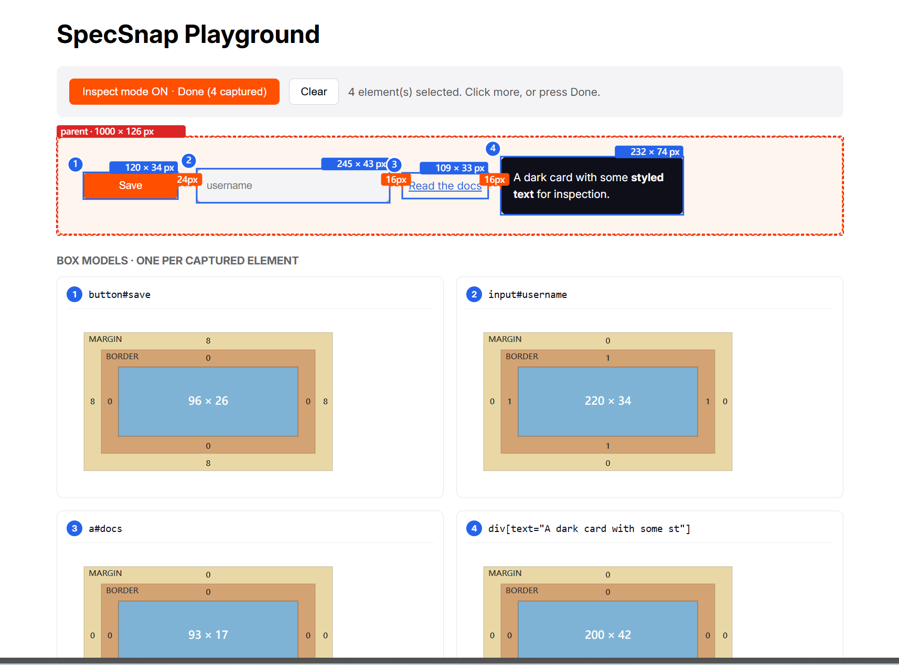

# SpecSnap

[English](./README.md) · [繁體中文](./README.zh-TW.md)

> 讓「人眼觀察 UI」和「AI 修改 UI」之間的翻譯損耗歸零的檢視器。

[](./LICENSE)
[](https://www.npmjs.com/package/@tw199501/specsnap-core)

## 實際長這樣

<video src="./docs/superpower/video/specsnap-demo.mp4" controls muted playsinline width="860">
  你的瀏覽器不支援嵌入影片。<a href="./docs/superpower/video/specsnap-demo.mp4">下載 demo</a>。
</video>



在頁面上點選多個元素，SpecSnap 一次全部擷取：

- **編號徽章** — 頁面 overlay、盒模型面板、匯出的 Markdown 共用同一組 ①②③，瀏覽器看到的 ① 就是檔案裡的 ①
- **元素間距** — 自動計算相鄰元素的 px 距離（橘色「24px」「16px」那些）。AI 拿到的是結構化間距數字，不是只有尺寸
- **每元素盒模型** — margin / border / padding / content 四層方塊，每邊都標數字
- **視窗脈絡** — 每次擷取都帶 viewport 資訊；沒有 `1440×900` 參照，「寬 120px」這句話對 AI 毫無意義
- **雙語標註** — 英文給 AI 精確、繁體中文給人類閱讀（`padding: 16px (內邊距)`）

## 為什麼要這個工具

任何跟 UI 有關的 AI 協作對話，都會撞同一道牆：

1. 人眼看到「那個按鈕怪怪的」
2. 人用文字描述觀察（「Save 按鈕感覺窄 8px」）
3. AI 把文字翻譯回程式碼修改
4. 每一層翻譯都在丟資訊

SpecSnap 把**第 2 步消掉**。你點選有問題的元素，AI 直接讀無法誤讀的結構化資料：帶 viewport 參照的座標、盒模型差異、元素間距、語意化的元素名稱。

## 版本狀態

Pre-alpha（v0.0.x）— schema 可能微調，v1.0 時凍結。

### v0.0.7 新增的功能

- **Inspector UI 套件** — `@tw199501/specsnap-inspector-core`（框架無關）、`@tw199501/specsnap-inspector-vue`（Vue 3）、`@tw199501/specsnap-inspector-react`（React 18+）。drop-in、零設定，見下方[使用 Inspector UI](#使用-inspector-ui)。
- **儲存三段降級** — fs-access → ZIP（`fflate`）→ 個別下載，自動協商。提供 `onSave` prop 可完全覆寫。
- **發版工具** — `changesets` 讓 4 個 published 套件 lockstep 連動升版；`dependency-cruiser` CI 把關，強制 `inspector-core` 維持框架無關。
- 0.0.6 版號刻意跳過，標記這是「Inspector 套件上架」的 release。

### v0.0.5 新增的功能

- **`data-i18n-key` / `data-v-source` 反查** — 如果 build-time 工具注入這兩個屬性，core 會讀進 `ElementIdentity.i18nKey` 和 `.source`，MD Basics 段也會加對應欄位。AI 可以直接做 i18n key 對照 + 原始檔定位，不需要 grep
- **Tag-triggered publish workflow** — `.github/workflows/publish.yml` 在 push `core@*` tag 時自動發 npm（需先加 `NPM_TOKEN` secret）
- `SCHEMA_VERSION` 升到 `'0.0.5'`（從 0.0.2 以來第一次 wire format 變動；新增欄位都 optional，不 break 向後相容）

### v0.0.4 新增的功能

- **File System Access API adapter** in playground — Copy MD 寫入使用者挑選的資料夾（Chrome / Edge 86+），舊瀏覽器 fallback 到 Downloads/
- **Border subpixel 顯示潤飾** — DPR 1.5 螢幕不再顯示 `0.67 / 0.67 / 0.67 / 0.67`，MD 四捨五入成 `1 / 1 / 1 / 1`；JSON 保留原始精度

### v0.0.3 新增的功能

- **`toAnnotatedPNG`** — 每 frame 一張標註 PNG，只突顯當前 focus frame
- **`toSpecSnapBundle`** — 可直接落地的 bundle：MD + PNG 命名 `YYYYMMDD-NN-*.png`、MD 內含相對路徑引用
- **capture `filter` 選項** — 排除使用者自己的 UI 元素（panel、toolbar）避免被拍進截圖

## 套件

| 套件 | 狀態 | 說明 |
| --- | --- | --- |
| [`@tw199501/specsnap-core`](./packages/core) | 0.0.7 | TypeScript 核心庫：擷取 + 序列化（MD / JSON）+ 標註 PNG + 磁碟落地 bundle + 可選 i18nKey / source |
| [`@tw199501/specsnap-inspector-core`](./packages/inspector-core) | 0.0.7 | 框架無關的 headless Inspector（元素選擇器、pub-sub store、序號計數、儲存三段降級） |
| [`@tw199501/specsnap-inspector-vue`](./packages/inspector-vue) | 0.0.7 | Vue 3 drop-in 元件 — `<SpecSnapInspector />` |
| [`@tw199501/specsnap-inspector-react`](./packages/inspector-react) | 0.0.7 | React 18+ drop-in 元件 — `<SpecSnapInspector />` |
| `specsnap-extension` | 規劃中 | Chrome / Edge / Firefox 瀏覽器擴充，包裝 core |
| [`apps/playground`](./apps/playground) | Vite 展示頁 | 多選檢視器示範（上方截圖即此頁） |

## 使用 Inspector UI

Vue 3 或 React 18+ 都是 drop-in 零設定。

### Vue 3

```bash
pnpm add @tw199501/specsnap-inspector-vue
```

```vue
<template>
  <SpecSnapInspector />
</template>

<script setup lang="ts">
import '@tw199501/specsnap-inspector-vue/styles.css';
import { SpecSnapInspector } from '@tw199501/specsnap-inspector-vue';
</script>
```

### React 18+

```bash
pnpm add @tw199501/specsnap-inspector-react
```

```tsx
import '@tw199501/specsnap-inspector-react/styles.css';
import { SpecSnapInspector } from '@tw199501/specsnap-inspector-react';

export default function App() {
  return <><YourApp /><SpecSnapInspector /></>;
}
```

右下角出現浮動 trigger 按鈕，點它開 Inspector 面板、選元素、Copy MD 把 Markdown 送到剪貼簿並把 `specsnap/YYYYMMDD/` 存到磁碟（Chromium）或下載成 ZIP（其他瀏覽器）。

不需要框架的使用者可以直接用 [`@tw199501/specsnap-inspector-core`](./packages/inspector-core)。

## 設計文件

- [創意願景](./docs/superpower/plan/2026-04-19-vision.md) · 為什麼做、要做什麼、7 條北極星原則
- [設計決議（v0 鎖定）](./docs/superpower/plan/2026-04-19-decisions.md) · Q1-Q9 + 理由
- [MVP core 計畫 — Part 1](./docs/superpower/plan/2026-04-19-mvp-core-plan-part-1.md) · bootstrap + types
- [MVP core 計畫 — Part 2](./docs/superpower/plan/2026-04-19-mvp-core-plan-part-2.md) · capture + serializers + ship
- [v0.0.1 回顧](./docs/superpower/plan/2026-04-20-retrospective-v001.md)
- [v0.0.3 core 計畫](./docs/superpower/plan/2026-04-20-v003-core-annotated-png-plan.md)
- [v0.0.4 + v0.0.5 收尾計畫](./docs/superpower/plan/2026-04-20-v004-v005-closeout-plan.md)

## 環境需求

- Node **22+**
- pnpm **9.15+**
- TypeScript **6+**（貢獻者需要）

## 開發指令

clone repo、裝過一次依賴後，以下指令都從 repo 根目錄跑。

### 日常開發

```bash
# 裝 workspace 依賴（第一次 + lockfile 變動時）
pnpm install

# 起 playground dev server — port 鎖死在 5999（vite.config.ts 強制）
# predev 會先 kill 佔用 5999 的殭屍進程
pnpm -F specsnap-playground dev
# → http://localhost:5999/
```

### 測試

```bash
# 跑所有 workspace 的測試（core + playground）
pnpm test

# 只跑 core（82 tests）
pnpm -F @tw199501/specsnap-core test

# 只跑 playground（fs-access adapter 邏輯）
pnpm -F specsnap-playground test

# 監看模式（core）
pnpm -F @tw199501/specsnap-core test:watch

# 測試覆蓋率報告 → packages/core/coverage/
pnpm -F @tw199501/specsnap-core test:coverage
```

### 檢查（LF + 型別）

```bash
# 跟發版 gate 一致：先查 LF、再每個 workspace 跑 tsc --noEmit
pnpm check
```

### 打包

```bash
# 建 packages/core 的 dist（tsup 產生 ESM + CJS + d.ts）
pnpm -F @tw199501/specsnap-core build

# 預覽 npm tarball 會包什麼（不上傳）
cd packages/core
npm pack --dry-run
cd ../..
```

### 發版流程

```bash
# 1) 改 packages/core/package.json 的 version
# 2) 更新 READMEs + 版本相關的測試
# 3) full gate 全綠才能打 tag
pnpm check && pnpm test && pnpm build

# 4) commit + tag
git add -A
git commit -m "release: @tw199501/specsnap-core@X.Y.Z"
git tag -a core@X.Y.Z -m "core X.Y.Z — one-line summary"

# 5) push main + tag
git push origin main
git push origin core@X.Y.Z

# 6) 發佈到 npm（互動式，若沒有 cache 的 token 會要 2FA）
cd packages/core
npm publish
```

設定 `NPM_TOKEN` repo secret 後，步驟 6 會由
[publish.yml](./.github/workflows/publish.yml) 在 tag push 時自動完成。

### 一鍵 CI gate

```bash
# GitHub Actions 跑的那套全裝在這
pnpm check && pnpm test && pnpm build
```

## 授權

[MIT](./LICENSE) © tw199501
